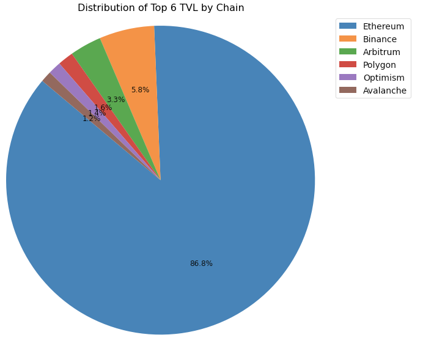

This notebook looks at how to get TVL data from top 10 chains with the highest TVL using DefiLama free API

DefiLama website: https://defillama.com/


```python 
#install and import
%pip install defilama
from defillama import DefiLlama

# Create a DeFiLlama object
llama  = DefiLlama()
```


Some web page calls that you can start with...
```python 
#Get all protocols listed on DefiLama
llama.get_all_protocols()

#Get info on specific protocol 
llama.get_protocol(protocol)

# Get historical values of total TVL
llama.get_historical_tvl()

# Get protocol TVL
llama.get_tvl(name='Name')
```


